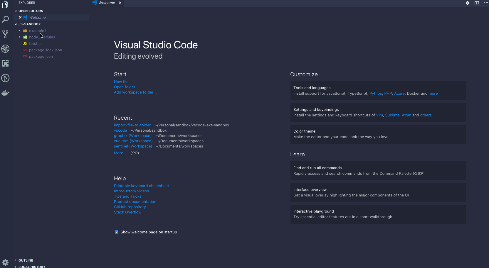

# import-file-to-folder README

This extension adds the functionality to import an existing file(s) into a folder.

## Features

Import a file (or several) to the desired folder by right-click on the folder and select the file(s) you want to import.

## Release Notes

### 0.2.1

Initial release

### 0.2.2

Added default keybinding

### 0.2.3

Added extension icon
