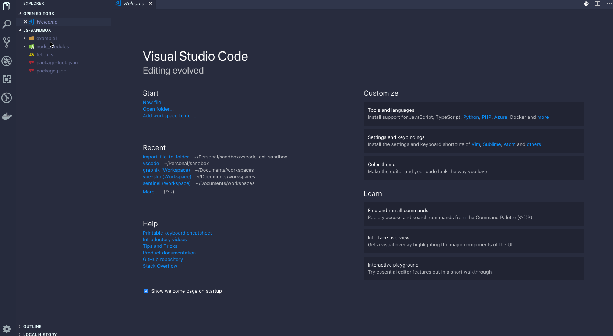

# import-file-to-folder README

This extension adds the functionality to import an existing file(s) into a folder.

## Features

Import a file (or several) to the desired folder by right-click on the folder and select the file(s) you want to import.

## Release Notes

### 0.2.1

Initial release

### 0.2.2

Added default keybinding

### 0.2.3

Added extension icon

### 0.4.0

Fix issue with importing multiple files

### 0.4.1

Autofix - Bump fstream from 1.0.11 to 1.0.12

### 0.5.1

Autofix - Bump js-yaml from 3.12.1 to 3.13.1

### 0.6.3

Adding OS specific file separator for more deterministic imports

### 0.10.0

Fixing root folder import

### 0.10.1

Fixing root folder import when file is selected

### 0.11.1

Update release notes

### 0.11.2

Fixing minimist vulnerability

### 0.11.3

Modernized build/test tooling (off deprecated `vscode`/`tslint` packages) and added CI/publish automation. No user-facing changes.

### 0.11.4

Added missing LICENSE file (MIT).

### 0.12.0

Importing a file that already exists in the target folder now prompts you to Overwrite, Skip, or apply that choice to the rest of the batch, instead of silently overwriting it. The "imported successfully" message now only appears when every selected file actually imported (no more false success on partial failure).